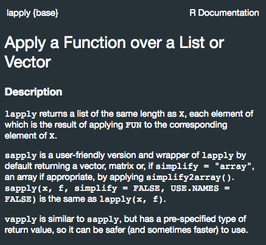

```{r setup, include=FALSE}
knitr::opts_chunk$set(echo = TRUE)
```

## Ayuda dentro de `R`

`R` es un lenguaje muy bien documentado y tanto las funciones base como las de paqueterías tienen sus respectivas descripciones. Una manera de llegar a esta información es usando la función `help()`, dándole como parámetro la función buscada.

```{r}
help(sapply)
```

En este documento no aparece el resultado porque no es una salida de consola. La documentación aparece en la pestaña `help` de RStudio.

{width=50%}


Otra forma de llegar a esta pestaña es escribiendo `?` antes de la función buscada.

```{r}
?table
```

La función `help.search()` funciona de manera similar pero también permite buscar conceptos con palabras clave, no solamente funciones. Esta función busca todos los resultados que contengan la palabra clave (o similares) en el sistema de ayuda de `R`. Es una especie de Google dentro de `R`.

Hablando de Google, siempre es una gran opción para buscar ayuda o aprender conceptos nuevos de `R`. Páginas como StackOverflow o Github son excelentes recursos para aprender y entender más sobre `R`.

## Ambiente R

Para trabajar con archivos es necesario tener la dirección absoluta o relativa (path) de estos, o bien indicarle a la sesión de `R` a qué directorio queremos que apunte. Esto se hace con la función `setwd()` y la dirección del directorio.

Las direcciones se escriben de la siguiente manera:

1. En Mac: `~/Documents/carpeta/archivo.pdf` de forma relativa o `Users/usuario/Documents/carpeta/archivo.pdf` de forma absoluta

2. En Mac: `...\documents\archivo.pdf` de forma relativa o `C:\Windows\system\documents\archivo.pdf` de forma absoluta

Por último,  se puede usar la función `quit()` o `q()` para cerrar la sesión de `R` desde la consola.


